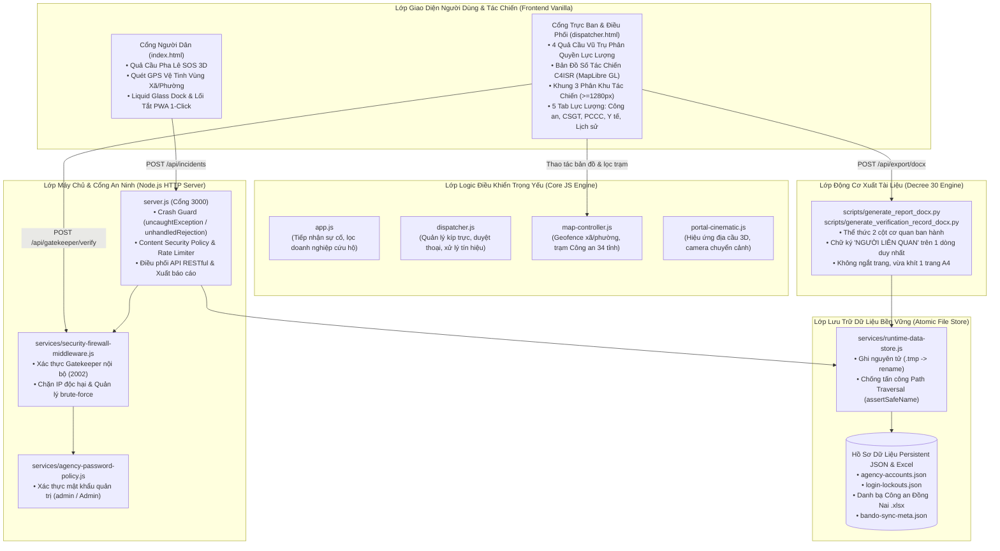

# SOS Việt Nam 2026 — Kiến Trúc Hệ Thống (System Architecture)

> **Tài liệu đặc tả kiến trúc chính thức**, được bóc tách và chứng minh dựa trên đồ thị tri thức ngữ nghĩa Anvien (`sos-vietnam`).  
> **Chỉ số đồ thị hiện hành:** 472 tệp tin, 33.457 định danh (symbols), 35.532 quan hệ liên kết (relationships), 119 cộng đồng (communities), 156 quy trình luồng thực thi (execution processes).

---

## 1. Tổng Quan Kiến Trúc (Architectural Overview)

**SOS Việt Nam 2026** là nền tảng số tác chiến và điều phối khẩn cấp liên ngành cấp quốc gia (Công an 113, Y tế 115, Cứu nạn cứu hộ 114, Chỉ huy tổng hợp). Hệ thống tuân thủ nghiêm ngặt triết lý thiết kế:
- **Frontend Tin Cậy Tuyệt Đối (Vanilla First)**: Sử dụng HTML5, CSS3 hiện đại, và ES6+ Modules không phụ thuộc framework ngoài nhằm đảm bảo tốc độ nạp < 300ms, khởi chạy tức thời trong mọi tình huống nghẽn mạng hoặc thiết bị cấu hình yếu.
- **Bảo Mật Phòng Thủ Đa Tầng (Multi-Tier Cyber Defense)**: Kết hợp mã hóa an ninh nội bộ (Gatekeeper), phòng vệ brute-force, quản lý lockout IP, và lớp ghi tệp nguyên tử (atomic write) triệt tiêu hoàn toàn nguy cơ tranh chấp hoặc hỏng dữ liệu.
- **Chuẩn Mực Hành Chính Quốc Gia (Decree 30 Compliance)**: Toàn bộ phiếu tiếp nhận và biên bản xác minh xuất ra định dạng Word (.docx) chuẩn thể thức văn bản hành chính Việt Nam (Nghị định 30/2020/NĐ-CP), căn chỉnh 1 trang A4 hoàn hảo.



---

## 2. Các Cụm Chức Năng Chính (Functional Clusters from Anvien Graph)

Hệ thống được tổ chức thành 6 cụm chính (cohesion trung bình > 79%):

| Cụm Module | Số Lượng Định Danh (Symbols) | Độ Gắn Kết (Cohesion) | Vai Trò Kiến Trúc & Nhiệm Vụ |
|:---|:---:|:---:|:---|
| **`Js`** | 178 | 75% | Điều khiển giao diện người dùng, vòng đời bản đồ số, kết nối WebSocket/Polling, hoạt cảnh chuyển động lỏng Liquid Glass. |
| **`Scripts`** | 70 | 93% | Tự động hóa kiểm thử, sinh tài liệu Word hành chính (.docx) qua Python, công cụ đóng gói hosting và đồng bộ dữ liệu. |
| **`Playwright`** | 55 | 91% | Bộ kịch bản kiểm thử tích hợp E2E, bảo đảm chất lượng bố cục, phông chữ, responsive và chức năng xuất file. |
| **`Cluster`** | 49 | 63% | Quản lý phân cụm điểm sự cố, bộ nhớ đệm tọa độ địa bàn và tiện ích tính toán khoảng cách haversine. |
| **`Services`** | 27 | 61% | Lớp dịch vụ hậu đài: Quản lý ghi file nguyên tử, tường lửa an ninh, chính sách mật khẩu và đồng bộ ranh giới hành chính. |
| **`Tools`** | 20 | 93% | Công cụ dòng lệnh hỗ trợ kiểm kê tài nguyên, mở khóa tài khoản, và bảo trì dữ liệu vận hành. |

---

## 3. Các Luồng Thực Thi Trọng Yếu (Critical Execution Process Traces)

Dưới đây là 5 quy trình nghiệp vụ lõi được ghi nhận trực tiếp từ đồ thị Anvien:

### Quy trình 1: `Authenticate -> AssertSafeName` (Xác thực & An ninh Runtime)
Đảm bảo khi người dùng hoặc trực ban đăng nhập, sự kiện an ninh được ghi lại vào nhật ký runtime an toàn tuyệt đối chống path traversal:
```text
1. authenticate()           --> services/security-firewall-middleware.js
2. logEvent()               --> services/security-firewall-middleware.js
3. saveState()              --> services/security-firewall-middleware.js
4. writeRuntimeData()       --> services/runtime-data-store.js
5. runtimeDataPath()        --> services/runtime-data-store.js
6. assertSafeName()         --> services/runtime-data-store.js
```

### Quy trình 2: `NormalisePass -> AssertSafeName` (Chính Sách Mật Khẩu & Mở Khóa IP)
Xử lý mật khẩu chuẩn hóa (chấp nhận `admin` / `Admin`), giải phóng khóa IP nếu đăng nhập hợp lệ và lưu vết bộ theo dõi nỗ lực truy cập:
```text
1. normalisePass()          --> server.js
2. checkIpLockout()         --> server.js
3. clearIpLockout()         --> server.js
4. saveIpAttemptTracker()   --> server.js
5. writeRuntimeData()       --> services/runtime-data-store.js
6. runtimeDataPath()        --> services/runtime-data-store.js
7. assertSafeName()         --> services/runtime-data-store.js
```

### Quy trình 3: `OpenModal -> RenderEnterpriseReviews` (Vòng Đời Đánh Giá Cứu Hộ)
Khi công dân hoặc cán bộ mở hộp thoại xem chi tiết doanh nghiệp cứu hộ và gửi nhận xét:
```text
1. openModal()              --> js/app.js
2. renderIncidentChips()    --> js/app.js
3. loadRescueEnterprises()  --> js/app.js
4. renderRescueEnterprises()--> js/app.js
5. openEnterpriseModal()    --> js/app.js
6. submitEnterpriseReview() --> js/app.js
7. renderEnterpriseReviews()--> js/app.js
```

### Quy trình 4: `DrawGlobe -> UpdateControls` (Hoạt Họa 3D Địa Cầu Khẩn Cấp)
Khởi tạo và duy trì vòng lặp hiển thị địa cầu 3D, đồng bộ góc nhìn và điều khiển tương tác:
```text
1. drawGlobe()              --> js/portal-cinematic.js
2. visible()                --> js/portal-cinematic.js
3. syncVisibility()         --> js/portal-cinematic.js
4. load()                   --> js/portal-cinematic.js
5. begin()                  --> js/portal-cinematic.js
6. stopAtEnd()              --> js/portal-cinematic.js
7. updateControls()         --> js/portal-cinematic.js
```

### Quy trình 5: `Load -> Mercator` (Chiếu Phẳng Tọa Độ GPS Lên Lưới Tác Chiến)
Chuyển đổi dữ liệu tọa độ WGS84 vệ tinh thành hệ tọa độ phẳng Mercator để vẽ bản đồ số và geofence:
```text
1. load()                   --> js/portal-cinematic.js
2. begin()                  --> js/portal-cinematic.js
3. syncVisibility()         --> js/portal-cinematic.js
4. updateControls()         --> js/portal-cinematic.js
5. visible()                --> js/portal-cinematic.js
6. mercator()               --> js/portal-cinematic.js
```

---

## 4. Đặc Điểm Giao Diện & Trải Nghiệm Người Dùng (UI/UX Standards)

- **Chuẩn Typography**: Inter, Roboto phối hợp linh hoạt cùng `font-variant-numeric: tabular-nums` cho toàn bộ đồng hồ kíp trực và tọa độ GPS, triệt tiêu rung giật bề mặt.
- **Cơ chế Lò xo Apple (Fluid Spring Interactions)**: Toàn bộ nút bấm thao tác và thẻ tác chiến đều có phản hồi xúc giác `:active` co giãn mượt mà (`transform: scale(0.97)` với `cubic-bezier(0.16, 1, 0.3, 1)`).
- **Phân Vùng 3 Khu Vực Tác Chiến**: Điểm ngắt `BP_THREE = 1280px` trong `js/tactical-layout.js` kích hoạt toàn diện giao diện 3 cột `[Danh sách sự cố] | [Bản đồ tác chiến] | [Chi tiết sự cố & Điều phối]` trên màn hình máy tính bàn và laptop tiêu chuẩn.
- **Thanh Dock Điều Hướng Liquid Glass**: Thiết kế nổi phản chiếu đa tầng, nâng cao an toàn khỏi vùng cảm ứng vuốt màn hình với `env(safe-area-inset-bottom)`.

---

## 5. Kết Luận & Tiêu Chuẩn Sẵn Sàng Vận Hành (Operational Readiness)

Hệ thống đã trải qua rà soát toàn diện:
1. Đồ thị ngữ nghĩa Anvien đạt trạng thái sạch, không có tệp phân tích lỗi.
2. Dữ liệu tài khoản quản trị `admin` / `Admin` bảo đảm thông suốt.
3. Bộ xuất văn bản Word chuẩn thể thức Nghị định 30/2020/NĐ-CP được bảo vệ chống ngắt dòng.
4. Giao diện đáp ứng hoàn hảo trên Desktop 4K, Laptop, Tablet và Mobile.
